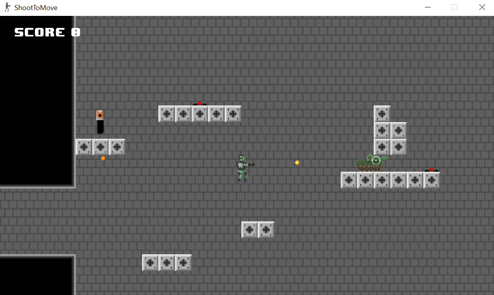

# ShootToMove
A simple 2D game made with MonoGame in C#  

As part of my A-Level computer science course I had to create a piece of software or do some kind of investigation.
I opted to do an investigation between using a framework, like MonoGame, VS. using an engine, like Unity, to create a game.
To do this I created this game in both Unity and MonoGame. The Unity version was a bit rushed and not my best work so it 
is not on GitHub, however, I am very proud of this MonoGame version.  

In the game you can walk around and jump and shoot, but whenever you shoot the force of the shot pushes you back with significant force.
You can use this to reach higher platforms and beat the game! To make this work I programmed my own, mini 2D physics and collision system.

Here is a screenshot of the first of three levels:  

  

A quick side note: I made all the art for this game and I don't think it looks terrible which makes me happy ;)

To compile this you will need to have MonoGame installed, head over to their website for more details.  
If you are looking to get into game development and are already familiar with C# or any other object-oriented 
programming language then I highly recommend MonoGame. I had a great deal of fun making this and learnt a lot during the process.
